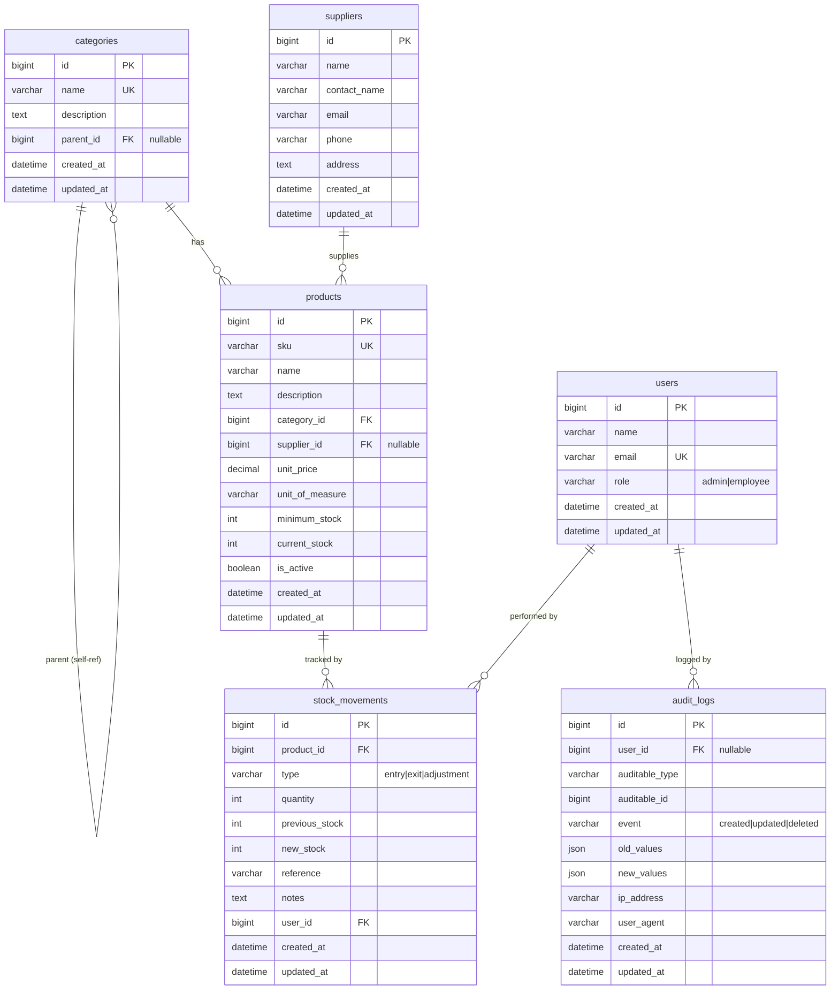
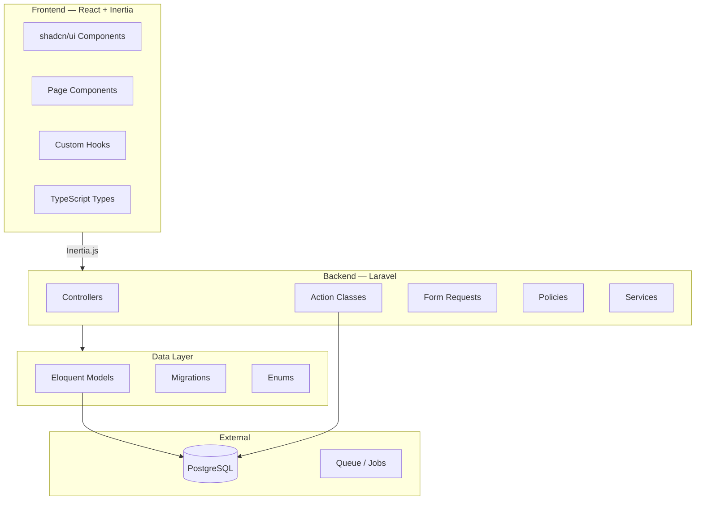

# 01 — Arquitectura del Sistema

> Visión general del diseño del sistema de inventario, stack tecnológico y modelo de entidad-relación.

---

## Stack

| Capa | Tecnología | Versión |
|------|-----------|---------|
| Language | PHP | 8.3 |
| Framework | Laravel | 13 |
| Database | PostgreSQL | — |
| Auth | Fortify + Passkeys + 2FA | — |
| Frontend | React | 19 |
| SPA Bridge | Inertia.js | v3 |
| Styling | Tailwind CSS | v4 |
| UI Library | shadcn/ui (Radix UI) | — |
| Testing | Pest | — |
| Code Style | Laravel Pint | — |

---

## Diagrama ER (Entity-Relationship)

---

## Diagrama de Componentes

---

## Decisiones Arquitectónicas

### 1. Actions Pattern
La lógica de negocio compleja se encapsula en clases de acción (`app/Actions/`) en lugar de colocarla directamente en controladores. Esto mejora la testabilidad y reutilización.

| Acción | Responsabilidad |
|--------|----------------|
| `RegisterEntryAction` | Registrar entrada de stock |
| `RegisterExitAction` | Registrar salida de stock (con validación) |
| `RegisterAdjustmentAction` | Ajustar stock directamente |
| `DeleteCategoryAction` | Eliminar categoría reasignando productos |

### 2. Form Requests
Cada endpoint de escritura tiene su propio Form Request para validación y normalización de datos. Se usa `prepareForValidation()` para sanitizar inputs antes de validar.

### 3. Policies
El control de acceso se maneja con Policies de Laravel, combinadas con un middleware `role:` personalizado para rutas que solo admin pueden acceder.

### 4. Auditable Trait
Los modelos domain (Product, Category, Supplier, StockMovement, User) usan el trait `Auditable` para registrar automáticamente cambios en `audit_logs`.

### 5. Inertia.js
El frontend se comunica con el backend vía Inertia.js, eliminando la necesidad de una API REST separada. Cada controlador renderiza componentes React directamente.

---

*Ver también: [Modelo de Datos](02-modelo-datos.md) · [Flujo de Stock](03-flujo-stock.md)*
