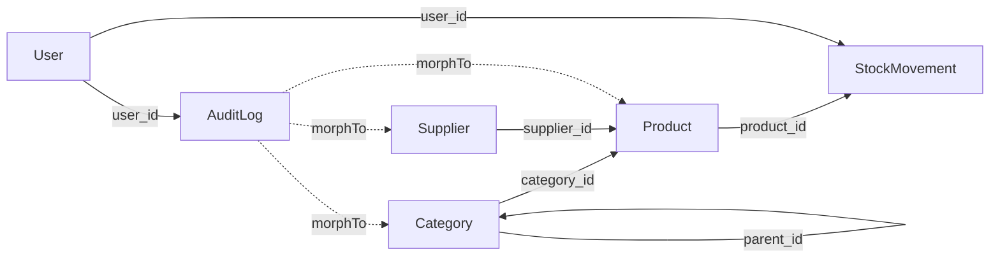

# 02 — Modelo de Datos

> Enums, migraciones, modelos Eloquent, relaciones, scopes y factories.

---

## Enums

### StockMovementType

**Archivo**: `app/Enums/StockMovementType.php`

```php
enum StockMovementType: string
{
    case Entry = 'entry';
    case Exit = 'exit';
    case Adjustment = 'adjustment';
}
```

| Case | Valor | Label |
|------|-------|-------|
| `Entry` | `entry` | Entrada |
| `Exit` | `exit` | Salida |
| `Adjustment` | `adjustment` | Ajuste |

### UserRole

**Archivo**: `app/Enums/UserRole.php`

```php
enum UserRole: string
{
    case Admin = 'admin';
    case Employee = 'employee';
}
```

| Case | Valor | Label | Métodos |
|------|-------|-------|---------|
| `Admin` | `admin` | Administrador | `isAdmin()` → `true` |
| `Employee` | `employee` | Empleado | `isEmployee()` → `true` |

---

## Tablas

### categories

| Columna | Tipo | Restricciones |
|---------|------|---------------|
| `id` | bigint | PK, auto-increment |
| `name` | varchar(100) | UNIQUE, NOT NULL |
| `description` | text | NULLABLE |
| `parent_id` | bigint | FK → categories.id, NULLABLE, nullOnDelete |
| `created_at` | timestamp | — |
| `updated_at` | timestamp | — |

**Índices**: `parent_id`

### suppliers

| Columna | Tipo | Restricciones |
|---------|------|---------------|
| `id` | bigint | PK, auto-increment |
| `name` | varchar(150) | NOT NULL |
| `contact_name` | varchar(150) | NULLABLE |
| `email` | varchar | NULLABLE |
| `phone` | varchar(50) | NULLABLE |
| `address` | text | NULLABLE |
| `created_at` | timestamp | — |
| `updated_at` | timestamp | — |

**Índices**: `name`

### products

| Columna | Tipo | Restricciones |
|---------|------|---------------|
| `id` | bigint | PK, auto-increment |
| `sku` | varchar(50) | UNIQUE, NOT NULL |
| `name` | varchar(200) | NOT NULL |
| `description` | text | NULLABLE |
| `category_id` | bigint | FK → categories.id, cascadeOnDelete |
| `supplier_id` | bigint | FK → suppliers.id, NULLABLE, nullOnDelete |
| `unit_price` | decimal(10,2) | DEFAULT 0 |
| `unit_of_measure` | varchar(50) | DEFAULT 'pieza' |
| `minimum_stock` | integer | DEFAULT 0 |
| `current_stock` | integer | DEFAULT 0 |
| `is_active` | boolean | DEFAULT true |
| `created_at` | timestamp | — |
| `updated_at` | timestamp | — |

**Índices**: `category_id`, `supplier_id`, `is_active`

> **Nota**: `current_stock` solo se modifica a través de movimientos de stock, nunca directamente.

### stock_movements

| Columna | Tipo | Restricciones |
|---------|------|---------------|
| `id` | bigint | PK, auto-increment |
| `product_id` | bigint | FK → products.id, cascadeOnDelete |
| `type` | varchar(20) | NOT NULL (entry/exit/adjustment) |
| `quantity` | integer | NOT NULL |
| `previous_stock` | integer | NOT NULL |
| `new_stock` | integer | NOT NULL |
| `reference` | varchar(100) | NULLABLE |
| `notes` | text | NULLABLE |
| `user_id` | bigint | FK → users.id, cascadeOnDelete |
| `created_at` | timestamp | — |
| `updated_at` | timestamp | — |

**Índices**: `product_id`, `type`, `created_at`

### users (extensión)

Se agrega columna `role` a la tabla `users` existente:

| Columna | Tipo | Restricciones |
|---------|------|---------------|
| `role` | varchar(20) | DEFAULT 'employee', INDEX |

### audit_logs

| Columna | Tipo | Restricciones |
|---------|------|---------------|
| `id` | bigint | PK, auto-increment |
| `user_id` | bigint | FK → users.id, NULLABLE, nullOnDelete |
| `auditable_type` | varchar | NOT NULL (Morph type) |
| `auditable_id` | bigint | NOT NULL (Morph ID) |
| `event` | varchar | NOT NULL (created/updated/deleted) |
| `old_values` | json | NULLABLE |
| `new_values` | json | NULLABLE |
| `ip_address` | varchar(45) | NULLABLE |
| `user_agent` | varchar | NULLABLE |
| `created_at` | timestamp | — |
| `updated_at` | timestamp | — |

**Índices**: `(auditable_type, auditable_id)`, `event`, `created_at`

---

## Relaciones Eloquent

| Modelo | Relación | Tipo | FK | Descripción |
|--------|----------|------|----|-------------|
| Category | `parent` | BelongsTo | parent_id | Categoría padre |
| Category | `children` | HasMany | parent_id | Subcategorías |
| Category | `products` | HasMany | category_id | Productos en la categoría |
| Supplier | `products` | HasMany | supplier_id | Productos del proveedor |
| Product | `category` | BelongsTo | category_id | Categoría del producto |
| Product | `supplier` | BelongsTo | supplier_id | Proveedor del producto |
| Product | `movements` | HasMany | product_id | Movimientos de stock |
| StockMovement | `product` | BelongsTo | product_id | Producto asociado |
| StockMovement | `user` | BelongsTo | user_id | Usuario que realizó el movimiento |
| AuditLog | `user` | BelongsTo | user_id | Usuario que generó el log |
| AuditLog | `auditable` | MorphTo | — | Modelo auditado |



---

## Scopes

### Product

| Scope | Parámetro | Descripción |
|-------|-----------|-------------|
| `scopeActive($query)` | — | Productos con `is_active = true` |
| `scopeLowStock($query)` | — | Productos donde `current_stock <= minimum_stock` |
| `scopeInCategory($query, $categoryId)` | `$categoryId` | Filtrar por categoría |
| `scopeFromSupplier($query, $supplierId)` | `$supplierId` | Filtrar por proveedor |
| `scopeSearch($query, $search)` | `$search` | Buscar por nombre o SKU |

### StockMovement

| Scope | Parámetro | Descripción |
|-------|-----------|-------------|
| `scopeForProduct($query, $productId)` | `$productId` | Filtrar por producto |
| `scopeOfType($query, $type)` | `$type` | Filtrar por tipo de movimiento |
| `scopeRecent($query, $days)` | `$days` (default: 30) | Movimientos de los últimos N días |

---

## Factories

| Factory | Estados | Descripción |
|---------|---------|-------------|
| `CategoryFactory` | `child(Category $parent)` | Categoría hija de un padre |
| `SupplierFactory` | — | Datos fake de empresa |
| `ProductFactory` | `lowStock()`, `inactive()` | Producto con stock bajo / inactivo |
| `StockMovementFactory` | `entry()`, `exit()`, `adjustment()` | Movimiento por tipo |
| `UserFactory` | `admin()`, `employee()` | Usuario con rol específico |

---

*Ver también: [Flujo de Stock](03-flujo-stock.md) · [Arquitectura del Sistema](01-arquitectura-sistema.md)*
