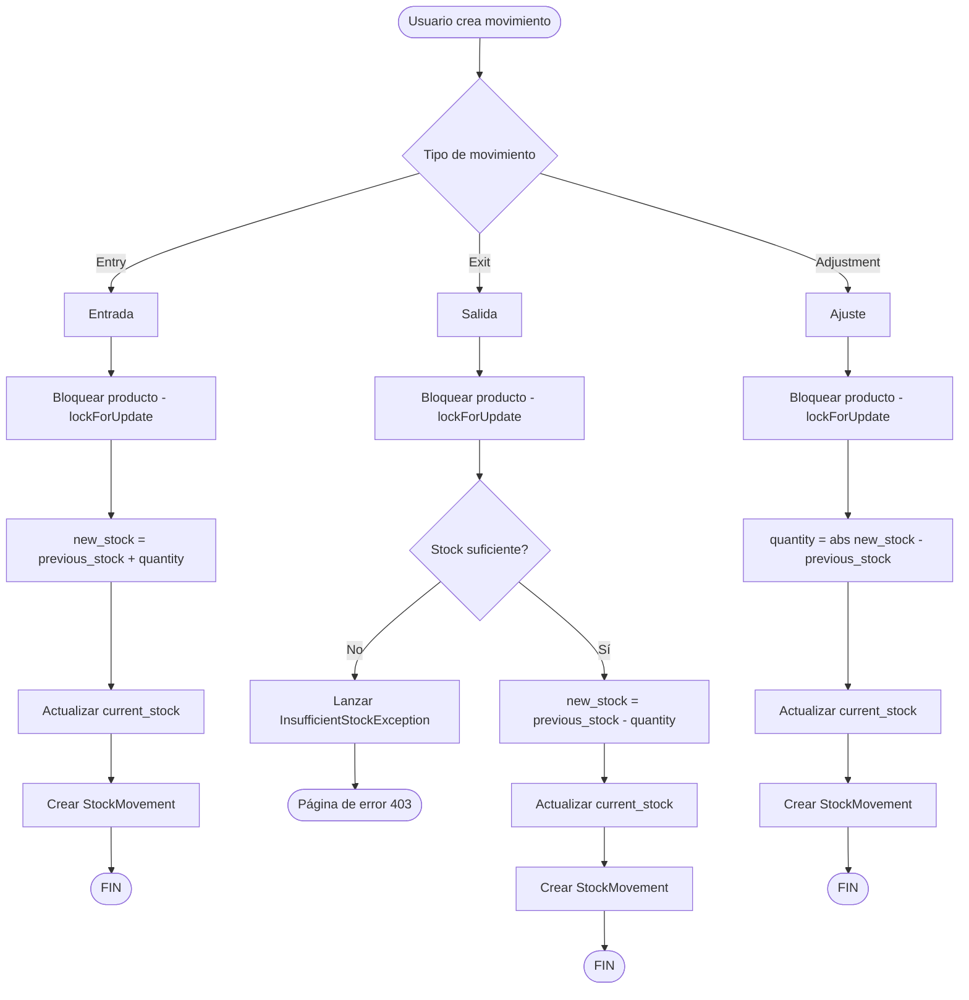
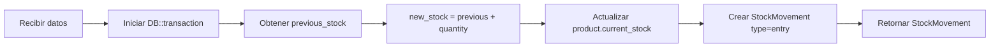
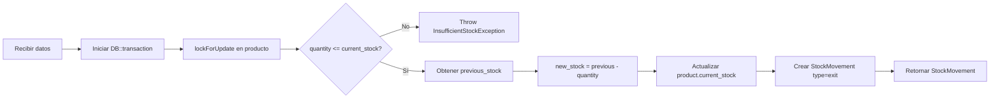
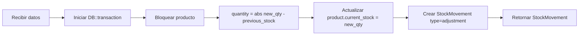

# 03 — Flujo de Stock

> Lógica de negocio para movimientos de inventario: entradas, salidas, ajustes y eliminación de categorías.

---

## Diagrama General de Movimientos



---

## 1. Registro de Entrada (Entry)

**Acción**: `app/Actions/Stock/RegisterEntryAction.php`



**Lógica**:
1. Se obtiene el `current_stock` actual del producto.
2. Se calcula `new_stock = previous_stock + quantity`.
3. Se actualiza `product.current_stock`.
4. Se crea el registro en `stock_movements` con tipo `entry`.

**No requiere validación de stock** — las entradas siempre son válidas.

---

## 2. Registro de Salida (Exit)

**Acción**: `app/Actions/Stock/RegisterExitAction.php`



**Lógica**:
1. Se bloquea el producto con `lockForUpdate()` para prevenir race conditions.
2. **Validación**: si `quantity > current_stock`, se lanza `InsufficientStockException`.
3. Se calcula `new_stock = previous_stock - quantity`.
4. Se actualiza `product.current_stock`.
5. Se crea el registro en `stock_movements` con tipo `exit`.

### InsufficientStockException

**Archivo**: `app/Exceptions/InsufficientStockException.php`

Se lanza cuando un usuario intenta retirar más stock del disponible.

```php
throw new InsufficientStockException($product, $quantity);
```

El frontend muestra un toast de error con el mensaje: *"No hay stock suficiente para [producto]. Disponible: [N], Solicitado: [N]"*

---

## 3. Registro de Ajuste (Adjustment)

**Acción**: `app/Actions/Stock/RegisterAdjustmentAction.php`



**Lógica**:
1. Se bloquea el producto.
2. Se calcula la diferencia: `quantity = abs(newQuantity - previousStock)`.
3. Se establece `product.current_stock = newQuantity` directamente.
4. Se crea el registro en `stock_movements` con tipo `adjustment`.

> Un ajuste puede ser **positivo** (agregar stock no registrado) o **negativo** (corregir exceso).

---

## 4. Eliminación de Categoría

**Acción**: `app/Actions/Category/DeleteCategoryAction.php`

```mermaid
flowchart TD
    A[Eliminar categoría] --> B{Tiene productos?}
    B -->|Sí| C[Crear/obtener "Sin categoría"]
    C --> D[Mover productos a "Sin categoría"]
    D --> E[Mover subcategorías a "Sin categoría"]
    B -->|No| F[Verificar subcategorías]
    E --> G[Eliminar categoría]
    F -->|Sí| C
    F -->|No| G
    G --> H([Categoría eliminada])
```

**Lógica**:
1. Se busca o crea la categoría por defecto `"Sin categoría"`.
2. Todos los productos de la categoría se reasignan a `"Sin categoría"`.
3. Todas las subcategorías se reasignan a `"Sin categoría"`.
4. Se elimina la categoría original.

---

## Transacciones y Concurrencia

Todos los movimientos de stock usan `DB::transaction()` para garantizar atomicidad:

```php
return DB::transaction(function () use ($product, $quantity, ...) {
    $product->lockForUpdate();  // Bloqueo pesimista
    // ... lógica de negocio ...
    $product->update(['current_stock' => $newStock]);
    return StockMovement::create([...]);
});
```

**`lockForUpdate()`** previene race conditions cuando múltiples usuarios modifican el stock del mismo producto simultáneamente.

---

## Servicio TextNormalizer

**Archivo**: `app/Services/TextNormalizer.php`

Normaliza datos antes de la validación en Form Requests:

| Método | Input | Output | Ejemplo |
|--------|-------|--------|---------|
| `normalizeEmail()` | `" User@Email.COM "` | `"user@email.com"` | lowercase + trim |
| `normalizeName()` | `"  john  DOE "` | `"John Doe"` | ucwords |
| `normalizePhone()` | `"04241234567"` | `"58(424)-123-4567"` | Formato venezolano |
| `normalizeSku()` | `" abc-123 "` | `"ABC-123"` | Uppercase + trim |
| `normalizeText()` | `"  multiple   spaces "` | `" multiple spaces"` | Colapsar espacios |

Se aplica en `prepareForValidation()` de cada Form Request:

| Form Request | Campos normalizados |
|---|---|
| `StoreSupplierRequest` | email, contact_name, phone, name, address |
| `UpdateSupplierRequest` | email, contact_name, phone, name, address |
| `StoreProductRequest` | sku, name, description |
| `UpdateProductRequest` | sku, name, description |
| `StoreCategoryRequest` | name, description |
| `UpdateCategoryRequest` | name, description |

---

*Ver también: [API y Rutas](04-api-rutas.md) · [Modelo de Datos](02-modelo-datos.md)*
