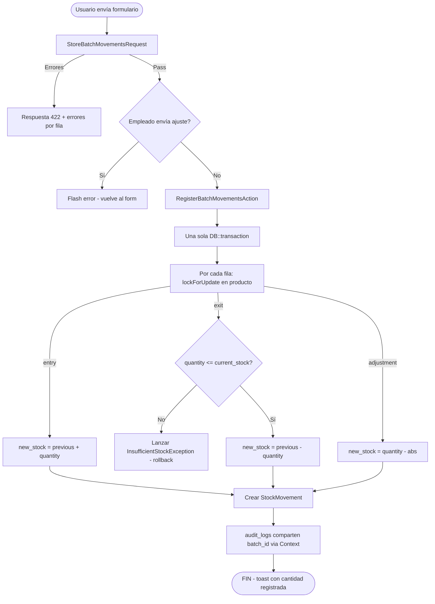
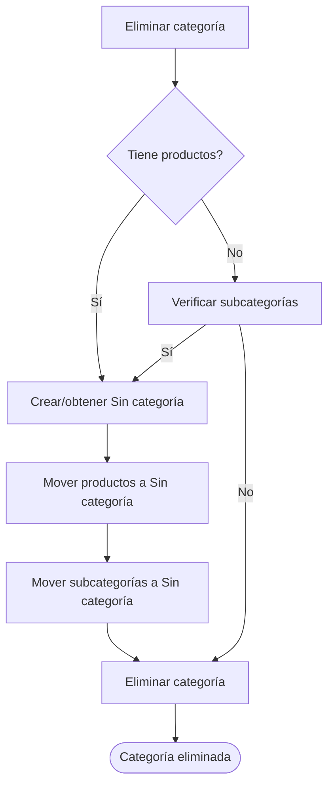

# 03 — Flujo de Stock

> Lógica de negocio para movimientos de inventario: registro en lote (entradas, salidas, ajustes) y eliminación de categorías.

---

## Diagrama General de Movimientos



> Notas:
> - El stock se pre-valida en `withValidator` de `StoreBatchMovementsRequest` (el error más común nunca llega al action).
> - No hay "página de error 403" configurada: el bloqueo de ajustes para employees devuelve un flash toast de error y `back()`.

---

## 1. Registro en Lote (Batch) — flujo actual

**Endpoint**: `POST /movements` → `StockMovementController::store`
**Form Request**: `app/Http/Requests/StockMovement/StoreBatchMovementsRequest.php`
**Acción**: `app/Actions/Stock/RegisterBatchMovementsAction.php`

### Payload

```json
{
  "movements": [
    { "product_id": 1, "type_movement": "entry", "quantity_movement": 10 },
    { "product_id": 2, "type_movement": "exit", "quantity_movement": 5 }
  ],
  "reference_movement": "OC-001",
  "notes_movement": "Recepción parcial"
}
```

### Validación (`StoreBatchMovementsRequest`)

| Regla | Valor |
|-------|-------|
| `movements` | required, array, min:1, **max:20** |
| `movements.*.product_id` | required, exists:products,id |
| `movements.*.type_movement` | required, enum `StockMovementType` |
| `movements.*.quantity_movement` | required, integer, min:1 |
| `reference_movement` | nullable, string, max:100 |
| `notes_movement` | nullable, string |

**Validación custom (`withValidator`)**:
- **Producto duplicado en el mismo lote** → error *"No puede registrar el mismo producto más de una vez en un lote."*
- **Salida mayor al stock disponible** → error por fila: *"Stock insuficiente para {producto}. Disponible: {N}"*

### Restricción de rol

- El form solo ofrece `entry`/`exit` a employees (el tipo `adjustment` se filtra en `create`).
- En `store`, si un employee envía un `adjustment`, se responde con flash toast de error *"No tienes permiso para crear movimientos de ajustes."* y `back()`.

### Ejecución (`RegisterBatchMovementsAction::handle`)

1. Genera un **UUID de lote** y lo guarda en `Context::add('audit_batch_id', $batchId)`.
2. Entra a **una sola `DB::transaction`**.
3. Por cada fila: `Product::lockForUpdate()->findOrFail()` y aplica la lógica correspondiente:
   - **entry**: `new = previous + quantity` → actualiza `current_stock_product`.
   - **exit**: si `quantity > current_stock_product` lanza `InsufficientStockException` (rollback del lote completo); si no, `new = previous - quantity`.
   - **adjustment**: `quantity_movement` registrado = `abs(newQuantity - previous)`; `current_stock_product = newQuantity`.
4. Crea el `StockMovement` con `previous_stock_movement` / `new_stock_movement`.
5. Los `audit_logs` generados en la transacción comparten `batch_id` (los lee `Auditable` desde Context).
6. `finally`: `Context::forget('audit_batch_id')`.

**Toast de éxito**: 1 movimiento → *"Movimiento registrado correctamente."*; N > 1 → *"N movimientos registrados correctamente."*

> Los actions unitarios (`RegisterEntryAction`, `RegisterExitAction`, `RegisterAdjustmentAction`) ya **no los invoca ningún controller** — quedan como referencia/legacy.

---

## 2. Eliminación de Categoría

**Acción**: `app/Actions/Category/DeleteCategoryAction.php`



**Lógica**:
1. Se busca o crea la categoría por defecto `"Sin categoría"`.
2. Todos los productos de la categoría se reasignan a `"Sin categoría"`.
3. Todas las subcategorías se reasignan a `"Sin categoría"`.
4. Se elimina la categoría original.

---

## Transacciones y Concurrencia

El registro en lote usa una sola `DB::transaction()` para garantizar atomicidad del lote completo:

```php
return DB::transaction(function () use ($movements, ...) {
    foreach ($movements as $movement) {
        $product = Product::lockForUpdate()->findOrFail($movement['product_id']);
        // ... lógica de negocio por tipo ...
        $product->update(['current_stock_product' => $newStock]);
        StockMovement::create([...]);
    }
});
```

**`lockForUpdate()`** previene race conditions cuando múltiples usuarios modifican el stock del mismo producto simultáneamente. Si cualquier fila falla, **todo el lote se revierte**.

### InsufficientStockException

**Archivo**: `app/Exceptions/InsufficientStockException.php`

Se lanza dentro de la transacción cuando una salida excede el stock disponible:

```php
throw new InsufficientStockException($product, $quantity);
```

Mensaje real: *"Stock insuficiente para el producto '{name_product}'. Solicitado: {N}, Disponible: {current_stock_product}"*

En la práctica, la mayoría de salidas insuficientes se detectan antes en la validación del Form Request (mensaje *"Stock insuficiente para {producto}. Disponible: {N}"*).

---

## Servicio TextNormalizer

**Archivo**: `app/Services/TextNormalizer.php`

Normaliza datos antes de la validación en Form Requests:

| Método | Input | Output | Ejemplo |
|--------|-------|--------|---------|
| `normalizeEmail()` | `" User@Email.COM "` | `"user@email.com"` | lowercase + trim |
| `normalizeName()` | `"  john  DOE "` | `"John Doe"` | ucwords |
| `normalizePhone()` | `"04241234567"` | `"58(424)-123-4567"` | Formato venezolano |
| `normalizeSku()` | `" abc-123 "` | `"ABC-123"` | Uppercase + trim |
| `normalizeText()` | `"  multiple   spaces "` | `" multiple spaces"` | Colapsar espacios |

Se aplica en `prepareForValidation()` de cada Form Request (los campos de negocio llevan sufijo):

| Form Request | Campos normalizados |
|---|---|
| `StoreSupplierRequest` / `UpdateSupplierRequest` | `email_supplier`, `contact_name_supplier`, `phone_supplier`, `name_supplier`, `address_supplier` |
| `StoreProductRequest` / `UpdateProductRequest` | `sku_product`, `name_product`, `description_product` |
| `StoreCategoryRequest` / `UpdateCategoryRequest` | `name_category`, `description_category` |
| `StoreUserRequest` / `UpdateUserRequest` | `name`, `email` |

---

*Ver también: [API y Rutas](04-api-rutas.md) · [Modelo de Datos](02-modelo-datos.md)*
