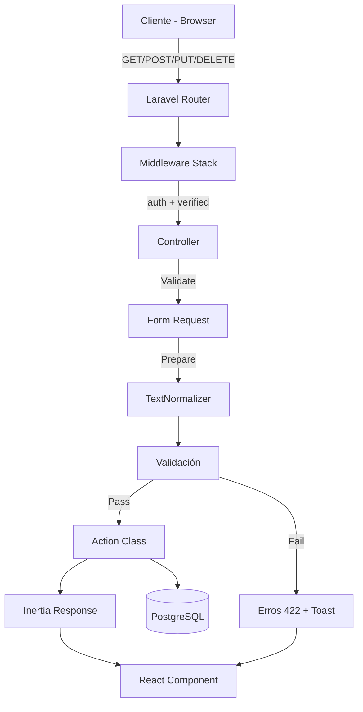

# 04 — API y Rutas

> Controladores, endpoints, Form Requests y validaciones.

---

## Diagrama de Flujo HTTP



---

## Resumen de Endpoints

| Recurso | Rutas | Controlador | Middleware |
|---------|-------|-------------|-----------|
| Dashboard | 1 | DashboardController | auth, verified |
| Categories | 7 (resource) | CategoryController | auth, verified |
| Suppliers | 7 (resource) | SupplierController | auth, verified |
| Products | 7 (resource) | ProductController | auth, verified |
| Movements | 4 (parcial) | StockMovementController | auth, verified |
| Users | 7 (resource) | UserController | auth, verified, **role:admin** |
| Reports | 5 | ReportController | auth, verified |
| Audit | 2 | AuditController | auth, verified, **role:admin** |

---

## Rutas Definidas

**Archivo**: `routes/web.php`

```php
Route::middleware(['auth', 'verified'])->group(function () {
    // Dashboard
    Route::get('dashboard', DashboardController::class)->name('dashboard');

    // CRUD Resources
    Route::resource('categories', CategoryController::class);
    Route::resource('suppliers', SupplierController::class);
    Route::resource('products', ProductController::class);

    // Movimientos (solo lectura + creación)
    Route::resource('movements', StockMovementController::class)
        ->only(['index', 'create', 'store', 'show']);

    // Usuarios (solo admin)
    Route::resource('users', UserController::class)->middleware('role:admin');

    // Reportes
    Route::prefix('reports')->name('reports.')->group(function () {
        Route::get('/', [ReportController::class, 'index'])->name('index');
        Route::get('/inventory', [ReportController::class, 'inventory'])->name('inventory');
        Route::get('/movements', [ReportController::class, 'movements'])->name('movements');
        Route::get('/stock-status', [ReportController::class, 'stockStatus'])->name('stock-status');
        Route::get('/export/{type}', [ReportController::class, 'export'])->name('export');
    });

    // Auditoría (solo admin)
    Route::prefix('audit')->name('audit.')->middleware('role:admin')->group(function () {
        Route::get('/', [AuditController::class, 'index'])->name('index');
        Route::get('/{auditLog}', [AuditController::class, 'show'])->name('show');
    });
});
```

---

## Controladores Detallados

### CategoryController

| Método | Ruta | Acción | Nombre |
|--------|------|--------|--------|
| GET | `/categories` | index | categories.index |
| GET | `/categories/create` | create | categories.create |
| POST | `/categories` | store | categories.store |
| GET | `/categories/{category}` | show | categories.show |
| GET | `/categories/{category}/edit` | edit | categories.edit |
| PUT/PATCH | `/categories/{category}` | update | categories.update |
| DELETE | `/categories/{category}` | destroy | categories.destroy |

**Lógica de negocio**:
- Nombre único por nivel (no global) — dos categorías hermanas no pueden tener el mismo nombre.
- No se puede eliminar una categoría con productos: se reasignan a "Sin categoría".

**Form Requests**:

| Request | Campos |
|---------|--------|
| `StoreCategoryRequest` | `name` (required, max:100), `description` (nullable), `parent_id` (nullable, exists) |
| `UpdateCategoryRequest` | `name` (required, max:100), `description` (nullable), `parent_id` (nullable, exists) |

---

### SupplierController

| Método | Ruta | Acción | Nombre |
|--------|------|--------|--------|
| GET | `/suppliers` | index | suppliers.index |
| GET | `/suppliers/create` | create | suppliers.create |
| POST | `/suppliers` | store | suppliers.store |
| GET | `/suppliers/{supplier}` | show | suppliers.show |
| GET | `/suppliers/{supplier}/edit` | edit | suppliers.edit |
| PUT/PATCH | `/suppliers/{supplier}` | update | suppliers.update |
| DELETE | `/suppliers/{supplier}` | destroy | suppliers.destroy |

**Lógica de negocio**:
- Email único si se proporciona.
- No se puede eliminar proveedor con productos asociados.

**Form Requests**:

| Request | Campos |
|---------|--------|
| `StoreSupplierRequest` | `name` (required, max:150), `contact_name` (nullable, max:150), `email` (nullable, email, unique), `phone` (nullable, max:50), `address` (nullable) |
| `UpdateSupplierRequest` | Mismos campos que Store (email unique ignore自身) |

---

### ProductController

| Método | Ruta | Acción | Nombre |
|--------|------|--------|--------|
| GET | `/products` | index | products.index |
| GET | `/products/create` | create | products.create |
| POST | `/products` | store | products.store |
| GET | `/products/{product}` | show | products.show |
| GET | `/products/{product}/edit` | edit | products.edit |
| PUT/PATCH | `/products/{product}` | update | products.update |
| DELETE | `/products/{product}` | destroy | products.destroy |

**Lógica de negocio**:
- SKU único (se normaliza a mayúsculas).
- `current_stock` solo se modifica vía movimientos de stock.

**Form Requests**:

| Request | Campos |
|---------|--------|
| `StoreProductRequest` | `sku` (required, max:50, unique), `name` (required, max:200), `description` (nullable), `category_id` (required, exists), `supplier_id` (nullable, exists), `unit_price` (required, numeric, min:0), `unit_of_measure` (required, max:50), `minimum_stock` (required, integer, min:0) |
| `UpdateProductRequest` | Mismos campos (sku unique ignore自身) |

---

### StockMovementController

| Método | Ruta | Acción | Nombre |
|--------|------|--------|--------|
| GET | `/movements` | index | movements.index |
| GET | `/movements/create` | create | movements.create |
| POST | `/movements` | store | movements.store |
| GET | `/movements/{movement}` | show | movements.show |

> No se permite editar ni eliminar movimientos — son registros de auditoría inmutables.

**Form Request**:

| Request | Campos |
|---------|--------|
| `StoreStockMovementRequest` | `product_id` (required, exists), `type` (required, in:entry/exit/adjustment), `quantity` (required, integer, min:1), `reference` (nullable, max:100), `notes` (nullable) |

---

### DashboardController

| Método | Ruta | Acción | Nombre |
|--------|------|--------|--------|
| GET | `/dashboard` | __invoke | dashboard |

**Datos retornados**:
- Total de productos activos
- Productos con stock bajo
- Total de categorías
- Total de proveedores
- Últimos 5 movimientos
- Valor total del inventario
- Rol del usuario actual (`admin` / `employee`)

---

### UserController

| Método | Ruta | Acción | Nombre | Middleware |
|--------|------|--------|--------|-----------|
| GET | `/users` | index | users.index | role:admin |
| GET | `/users/create` | create | users.create | role:admin |
| POST | `/users` | store | users.store | role:admin |
| GET | `/users/{user}` | show | users.show | role:admin |
| GET | `/users/{user}/edit` | edit | users.edit | role:admin |
| PUT/PATCH | `/users/{user}` | update | users.update | role:admin |
| DELETE | `/users/{user}` | destroy | users.destroy | role:admin |

**Lógica de negocio**:
- Solo admin puede gestionar usuarios.
- Email único.
- Al crear usuario, asignar role por defecto `employee`.
- No permitir eliminar el propio usuario.
- Password opcional en update.

**Form Requests**:

| Request | Campos |
|---------|--------|
| `StoreUserRequest` | `name` (required, max:255), `email` (required, email, unique), `password` (required, min:8, confirmed), `role` (required, enum) |
| `UpdateUserRequest` | `name` (required), `email` (required, unique ignore自身), `password` (nullable, min:8, confirmed), `role` (required, enum) |

---

### ReportController

| Método | Ruta | Acción | Nombre |
|--------|------|--------|--------|
| GET | `/reports` | index | reports.index |
| GET | `/reports/inventory` | inventory | reports.inventory |
| GET | `/reports/movements` | movements | reports.movements |
| GET | `/reports/stock-status` | stockStatus | reports.stock-status |
| GET | `/reports/export/{type}` | export | reports.export |

`{type}` = `csv` | `pdf` | `xlsx`

**ReportRequest** — filtros comunes:

| Campo | Tipo | Restricción |
|-------|------|------------|
| `date_from` | date | nullable |
| `date_to` | date | nullable, after_or_equal:date_from |
| `category_id` | integer | nullable, exists |
| `supplier_id` | integer | nullable, exists |
| `product_id` | integer | nullable, exists |
| `type_movement` | string | nullable, enum StockMovementType |

---

### AuditController

| Método | Ruta | Acción | Nombre | Middleware |
|--------|------|--------|--------|-----------|
| GET | `/audit` | index | audit.index | role:admin |
| GET | `/audit/{auditLog}` | show | audit.show | role:admin |

**Lógica**:
- Solo admin puede ver registros de auditoría.
- Filtros: usuario, modelo, evento, rango de fechas.
- Paginación: 25 registros por página.

**AuditRequest**:

| Campo | Tipo | Restricción |
|-------|------|------------|
| `user_id` | integer | nullable, exists |
| `auditable_type` | string | nullable |
| `event` | string | nullable, in:created/updated/deleted |
| `date_from` | date | nullable |
| `date_to` | date | nullable, after_or_equal:date_from |

---

*Ver también: [Flujo de Stock](03-flujo-stock.md) · [Autorización](05-autorizacion.md)*
