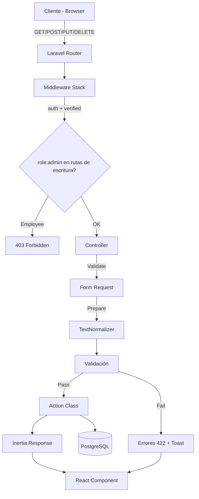

# 04 — API y Rutas

> Controladores, endpoints, Form Requests y validaciones.

---

## Diagrama de Flujo HTTP



---

## Resumen de Endpoints

| Recurso | Rutas | Controlador | Middleware |
|---------|-------|-------------|-----------|
| Home | 1 (`/` → welcome) | Inertia directo | — |
| Dashboard | 1 | DashboardController | auth, verified |
| Categories | 7 (split resource) | CategoryController | index/show: auth, verified · **create/store/edit/update/destroy: role:admin** |
| Suppliers | 7 (split resource) | SupplierController | index/show: auth, verified · **escrituras: role:admin** |
| Products | 7 (split resource) | ProductController | index/show: auth, verified · **escrituras: role:admin** |
| Movements | 4 (parcial, store = **batch**) | StockMovementController | auth, verified |
| Users | 7 (resource) | UserController | auth, verified, **role:admin** |
| Reports | 5 | ReportController | auth, verified · **`/reports/inventory`: role:admin** |
| Audit | 2 | AuditController | auth, verified, **role:admin** |
| Settings | profile, security, appearance | Settings controllers | auth (routes/settings.php) |

> **Clave**: desde el ajuste de permisos del rol empleado, las rutas de **escritura** de categorías/proveedores/productos viven dentro de un grupo `role:admin` — un employee recibe **403** en `create/store/edit/update/destroy`. Solo lectura (`index/show`) está abierta a ambos roles.

---

## Rutas Definidas

**Archivo**: `routes/web.php`

```php
Route::inertia('/', 'welcome')->name('home');

Route::middleware(['auth', 'verified'])->group(function () {
    Route::get('dashboard', DashboardController::class)->name('dashboard');

    // Escrituras: solo admin
    Route::middleware('role:admin')->group(function () {
        Route::resource('categories', CategoryController::class)
            ->only(['create', 'store', 'edit', 'update', 'destroy']);
        Route::resource('suppliers', SupplierController::class)
            ->only(['create', 'store', 'edit', 'update', 'destroy']);
        Route::resource('products', ProductController::class)
            ->only(['create', 'store', 'edit', 'update', 'destroy']);
    });

    // Lectura: ambos roles
    Route::resource('categories', CategoryController::class)->only(['index', 'show']);
    Route::resource('suppliers', SupplierController::class)->only(['index', 'show']);
    Route::resource('products', ProductController::class)->only(['index', 'show']);

    // Movimientos (store registra un lote de 1..N movimientos)
    Route::resource('movements', StockMovementController::class)
        ->only(['index', 'create', 'store', 'show']);

    // Usuarios (solo admin)
    Route::resource('users', UserController::class)->middleware('role:admin');

    // Reportes
    Route::prefix('reports')->name('reports.')->group(function () {
        Route::get('/', [ReportController::class, 'index'])->name('index');
        Route::get('/inventory', [ReportController::class, 'inventory'])
            ->name('inventory')->middleware('role:admin');
        Route::get('/movements', [ReportController::class, 'movements'])->name('movements');
        Route::get('/stock-status', [ReportController::class, 'stockStatus'])->name('stock-status');
        Route::get('/export/{type}', [ReportController::class, 'export'])->name('export');
    });

    // Auditoría (solo admin)
    Route::prefix('audit')->name('audit.')->middleware('role:admin')->group(function () {
        Route::get('/', [AuditController::class, 'index'])->name('index');
        Route::get('/{auditLog}', [AuditController::class, 'show'])->name('show');
    });
});

require __DIR__.'/settings.php';
```

---

## Controladores Detallados

### CategoryController

| Método | Ruta | Acción | Nombre | Middleware |
|--------|------|--------|--------|-----------|
| GET | `/categories` | index | categories.index | — |
| GET | `/categories/create` | create | categories.create | **role:admin** |
| POST | `/categories` | store | categories.store | **role:admin** |
| GET | `/categories/{category}` | show | categories.show | — |
| GET | `/categories/{category}/edit` | edit | categories.edit | **role:admin** |
| PUT/PATCH | `/categories/{category}` | update | categories.update | **role:admin** |
| DELETE | `/categories/{category}` | destroy | categories.destroy | **role:admin** |

**Lógica de negocio**:
- `name_category` es **única a nivel global** (constraint UNIQUE en la tabla; no hay validación `unique` en el Form Request — la viola la base de datos).
- No se puede eliminar una categoría con productos: se reasignan a "Sin categoría" (`DeleteCategoryAction`).

**Form Requests**:

| Request | Campos |
|---------|--------|
| `StoreCategoryRequest` | `name_category` (required, string, max:100), `description_category` (nullable, string), `parent_category_id` (nullable, exists:categories,id) |
| `UpdateCategoryRequest` | Mismos campos; `parent_category_id` añade `Rule::notIn([$categoryId])` (no ser padre de sí misma) |

---

### SupplierController

| Método | Ruta | Acción | Nombre | Middleware |
|--------|------|--------|--------|-----------|
| GET | `/suppliers` | index | suppliers.index | — |
| POST | `/suppliers` | store | suppliers.store | **role:admin** |
| GET | `/suppliers/{supplier}` | show | suppliers.show | — |
| GET/PUT/DELETE … | (resource) | create/edit/update/destroy | suppliers.* | **role:admin** |

**Lógica de negocio**:
- `email_supplier` única si se proporciona (unique en Form Request, con `ignore($id)` en update).

**Form Requests**:

| Request | Campos |
|---------|--------|
| `StoreSupplierRequest` | `name_supplier` (required, max:150), `contact_name_supplier` (nullable, max:150), `email_supplier` (nullable, email, unique:suppliers,email_supplier), `phone_supplier` (nullable, max:50), `address_supplier` (nullable, string) |
| `UpdateSupplierRequest` | Mismos campos (email unique ignore self) |

---

### ProductController

| Método | Ruta | Acción | Nombre | Middleware |
|--------|------|--------|--------|-----------|
| GET | `/products` | index | products.index | — |
| POST | `/products` | store | products.store | **role:admin** |
| GET | `/products/{product}` | show | products.show | — |
| GET/PUT/DELETE … | (resource) | create/edit/update/destroy | products.* | **role:admin** |

**Lógica de negocio**:
- SKU único (se normaliza a mayúsculas en `prepareForValidation`).
- `current_stock_product` solo se modifica vía movimientos de stock.

**Form Requests**:

| Request | Campos |
|---------|--------|
| `StoreProductRequest` | `sku_product` (required, max:50, unique), `name_product` (required, max:200), `description_product` (nullable), `category_id` (required, exists), `supplier_id` (nullable, exists), `unit_price_product` (required, numeric, min:0), `unit_of_measure_product` (required, max:50), `minimum_stock_product` (required, integer, min:0), `current_stock_product` (nullable, integer, min:0) |
| `UpdateProductRequest` | Mismos campos (sku unique ignore self; sin `current_stock_product`) |

---

### StockMovementController

| Método | Ruta | Acción | Nombre |
|--------|------|--------|--------|
| GET | `/movements` | index | movements.index |
| GET | `/movements/create` | create | movements.create |
| POST | `/movements` | store | movements.store |
| GET | `/movements/{movement}` | show | movements.show |

> No se permite editar ni eliminar movimientos — son registros de auditoría inmutables.

**Datos scoping**:
- `index`/`show`: un employee **solo ve sus propios movimientos** (`where user_id = self`); admin ve todos. Reciben prop `isAdmin`.
- `create`: los tipos se filtran — employee solo ve `entry`/`exit` (sin `adjustment`).
- `store` es un **endpoint batch**: registra 1..20 movimientos en una transacción (ver [Flujo de Stock](03-flujo-stock.md)).

**Form Request — `StoreBatchMovementsRequest`**:

| Campo | Reglas |
|-------|--------|
| `movements` | required, array, min:1, **max:20** |
| `movements.*.product_id` | required, exists:products,id |
| `movements.*.type_movement` | required, enum `StockMovementType` |
| `movements.*.quantity_movement` | required, integer, min:1 |
| `reference_movement` | nullable, string, max:100 |
| `notes_movement` | nullable, string |

Custom (`withValidator`): rechaza productos duplicados en el lote y pre-valida stock de salidas por fila.

> `StoreStockMovementRequest` (payload plano legacy) ya no se usa en ninguna ruta.

**Respuesta**: redirect a `movements.index` con flash toast de éxito indicando cuántos movimientos se registraron.

---

### DashboardController

| Método | Ruta | Acción | Nombre |
|--------|------|--------|--------|
| GET | `/dashboard` | __invoke | dashboard |

**Datos retornados** (props Inertia):
- `stats.total_products`, `stats.low_stock_products`, `stats.total_categories`, `stats.total_suppliers`
- `stats.inventory_value` — **solo admin** (employee recibe `null`)
- `stats.my_movements_today` — **solo employee** (admin recibe `null`)
- `recentMovements` — últimos **3**; un employee solo recibe los suyos
- `lowStockProducts` — top **5**
- `isAdmin` — booleano derivado de `$user->isAdmin()`

---

### UserController

| Método | Ruta | Acción | Nombre | Middleware |
|--------|------|--------|--------|-----------|
| GET | `/users` | index | users.index | role:admin |
| GET | `/users/create` | create | users.create | role:admin |
| POST | `/users` | store | users.store | role:admin |
| GET | `/users/{user}` | show | users.show | role:admin |
| GET | `/users/{user}/edit` | edit | users.edit | role:admin |
| PUT/PATCH | `/users/{user}` | update | users.update | role:admin |
| DELETE | `/users/{user}` | destroy | users.destroy | role:admin |

**Lógica de negocio**:
- Solo admin puede gestionar usuarios (middleware + `UserPolicy`).
- Email único.
- No permitir eliminar el propio usuario (`UserPolicy::delete` exige `id !== self`).
- Password opcional en update.

**Form Requests**:

| Request | Campos |
|---------|--------|
| `StoreUserRequest` | `name` (required, max:255), `email` (required, email, unique), `password` (required, min:8, confirmed, `Password::defaults()`), `role` (required, `Rule::enum(UserRole::class)`) |
| `UpdateUserRequest` | `name` (required), `email` (required, unique ignore self), `password` (nullable, min:8, confirmed), `role` (required, enum) |

---

### ReportController

| Método | Ruta | Acción | Nombre | Middleware |
|--------|------|--------|--------|-----------|
| GET | `/reports` | index | reports.index | — |
| GET | `/reports/inventory` | inventory | reports.inventory | **role:admin** |
| GET | `/reports/movements` | movements | reports.movements | — |
| GET | `/reports/stock-status` | stockStatus | reports.stock-status | — |
| GET | `/reports/export/{type}` | export | reports.export | — |

`{type}` = `csv` | `pdf` | `xlsx`

**Scoping por rol**:
- `reports.index` recibe props `categories`, `suppliers`, `isAdmin` (la card de inventario se oculta a employees).
- `reports.movements`: un employee **solo ve y resume sus propios movimientos**; el filtro `user_id` y la lista `users` son solo para admin (`users` = colección vacía para employee). Recibe `isAdmin`.

**ReportRequest** — filtros comunes:

| Campo | Tipo | Restricción |
|-------|------|------------|
| `date_from` | date | nullable |
| `date_to` | date | nullable, after_or_equal:date_from |
| `category_id` | integer | nullable, exists |
| `supplier_id` | integer | nullable, exists |
| `product_id` | integer | nullable, exists |
| `type_movement` | string | nullable, enum StockMovementType |

---

### AuditController

| Método | Ruta | Acción | Nombre | Middleware |
|--------|------|--------|--------|-----------|
| GET | `/audit` | index | audit.index | role:admin |
| GET | `/audit/{auditLog}` | show | audit.show | role:admin |

**Lógica**:
- Solo admin puede ver registros de auditoría.
- Filtros: usuario, modelo, evento, rango de fechas.
- Paginación: 25 por página, `per_page` acotado a 1–100.
- `show` carga el log con `user` y, si el log tiene `batch_id`, retorna también **`batchSiblings`** (todos los logs del mismo lote ordenados por `created_at`).

**AuditRequest**:

| Campo | Tipo | Restricción |
|-------|------|------------|
| `user_id` | integer | nullable, exists |
| `auditable_type` | string | nullable |
| `event` | string | nullable, in:created/updated/deleted |
| `date_from` | date | nullable |
| `date_to` | date | nullable, after_or_equal:date_from |

---

*Ver también: [Flujo de Stock](03-flujo-stock.md) · [Autorización](05-autorizacion.md)*
