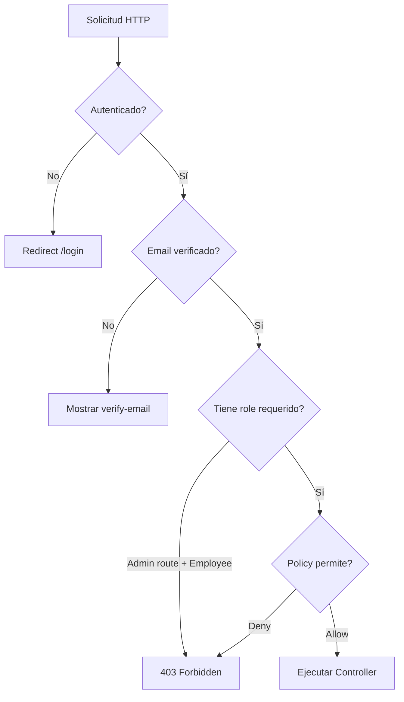

# 05 — Autenticación y Autorización

> Roles de usuario, middleware, policies y control de acceso.

---

## Diagrama de Flujo de Autorización



---

## Roles de Usuario

### Enum UserRole

**Archivo**: `app/Enums/UserRole.php`

| Rol | Valor | Label | Descripción |
|-----|-------|-------|-------------|
| `Admin` | `admin` | Administrador | Acceso total al sistema |
| `Employee` | `employee` | Empleado | Acceso limitado |

### Métodos del Enum

```php
UserRole::Admin->label();      // 'Administrador'
UserRole::Admin->isAdmin();    // true
UserRole::Admin->isEmployee(); // false
```

---

## Permisos por Rol

Efectivos a nivel de rutas y datos (verificados por `tests/Feature/EmployeePermissionsTest.php`):

| Recurso | Admin | Employee |
|---------|-------|----------|
| **Dashboard** | Ver (stats completos, últimos 3 movimientos globales, top 5 stock bajo) | Ver (stats redactados: sin `inventory_value`, con `my_movements_today`, solo **sus** movimientos) |
| **Categorías** | CRUD completo | **Solo lectura** (`index`/`show`) — 403 en escrituras |
| **Proveedores** | CRUD completo | **Solo lectura** — 403 en escrituras |
| **Productos** | CRUD completo | **Solo lectura** — 403 en escrituras |
| **Movimientos** | Ver todos, crear cualquier tipo | Ver **solo los suyos**, crear **entry/exit** (sin `adjustment`) |
| **Usuarios** | CRUD completo | No acceso (403) |
| **Reportes** | Inventario + movimientos + stock + export | **Sin** `/reports/inventory` (403); movimientos/stock/export solo con **sus** datos |
| **Auditoría** | Ver | No acceso (403) |

> El gate real de escritura es el **middleware `role:admin` a nivel de ruta** (`routes/web.php`), no las policies — un employee puede tener policies permisivas en Category/Supplier/Product y aun así recibir 403 al intentar crear/editar/eliminar.

---

## Middleware RoleMiddleware

**Archivo**: `app/Http/Middleware/RoleMiddleware.php`

```php
Route::middleware('role:admin')->group(function () {
    Route::resource('categories', CategoryController::class)
        ->only(['create', 'store', 'edit', 'update', 'destroy']);
});
```

El middleware valida que el usuario autenticado tenga al menos uno de los roles especificados; en caso contrario responde 403.

**Registro** en `bootstrap/app.php`:

```php
->withMiddleware(function (Middleware $middleware) {
    $middleware->alias([
        'role' => \App\Http\Middleware\RoleMiddleware::class,
    ]);
})
```

> El `bootstrap/app.php` real también registra `HandleAppearance`, `HandleInertiaRequests`, `AddLinkHeadersForPreloadedAssets` y cifrado de cookies.

---

## Policies

### Resumen de Políticas

| Policy | Admin | Employee |
|--------|-------|----------|
| `UserPolicy` | full CRUD | solo `view` del perfil propio |
| `CategoryPolicy` | full CRUD | viewAny, view, create, update (delete ❌) — **anulado por rutas role:admin** |
| `SupplierPolicy` | full CRUD | viewAny, view, create, update (delete ❌) — **anulado por rutas role:admin** |
| `ProductPolicy` | full CRUD | viewAny, view, create, update (delete ❌) — **anulado por rutas role:admin** |
| `StockMovementPolicy` | full CRUD | viewAny, view, create |

### UserPolicy

| Método | Admin | Employee |
|--------|-------|----------|
| `viewAny($user)` | ✅ | ❌ (`isAdmin()`) |
| `view($user, $model)` | ✅ | ✅ (solo propio) |
| `create($user)` | ✅ | ❌ |
| `update($user, $model)` | ✅ | ❌ (`isAdmin()`) |
| `delete($user, $model)` | ✅ (no a sí mismo) | ❌ |
| `restore($user, $model)` | ✅ | ❌ |
| `forceDelete($user, $model)` | ✅ | ❌ |

### CategoryPolicy

| Método | Admin | Employee |
|--------|-------|----------|
| `viewAny($user)` | ✅ | ✅ |
| `view($user, $model)` | ✅ | ✅ |
| `create($user)` | ✅ | ✅ (pero 403 por ruta) |
| `update($user, $model)` | ✅ | ✅ (pero 403 por ruta) |
| `delete($user, $model)` | ✅ | ❌ |

### SupplierPolicy

| Método | Admin | Employee |
|--------|-------|----------|
| `viewAny($user)` | ✅ | ✅ |
| `view($user, $model)` | ✅ | ✅ |
| `create($user)` | ✅ | ✅ (pero 403 por ruta) |
| `update($user, $model)` | ✅ | ✅ (pero 403 por ruta) |
| `delete($user, $model)` | ✅ | ❌ |

### ProductPolicy

| Método | Admin | Employee |
|--------|-------|----------|
| `viewAny($user)` | ✅ | ✅ |
| `view($user, $model)` | ✅ | ✅ |
| `create($user)` | ✅ | ✅ (pero 403 por ruta) |
| `update($user, $model)` | ✅ | ✅ (pero 403 por ruta) |
| `delete($user, $model)` | ✅ | ❌ |

### StockMovementPolicy

| Método | Admin | Employee |
|--------|-------|----------|
| `viewAny($user)` | ✅ | ✅ |
| `view($user, $model)` | ✅ | ✅ |
| `create($user)` | ✅ | ✅ |
| `update($user, $model)` | ✅ | ❌ |
| `delete($user, $model)` | ✅ | ❌ |

---

## Autenticación (Fortify)

El proyecto usa **Laravel Fortify** para autenticación:

| Funcionalidad | Estado |
|---------------|--------|
| Login | ✅ Implementado |
| Registro | ✅ Implementado |
| Forgot Password | ✅ Implementado |
| Reset Password | ✅ Implementado |
| Email Verification | ✅ Implementado |
| Password Confirmation | ✅ Implementado |
| Two-Factor Auth (2FA/TOTP) | ✅ Implementado |
| Passkeys (WebAuthn) | ✅ Implementado |

---

*Ver también: [API y Rutas](04-api-rutas.md) · [Reportes y Auditoría](06-reporte-auditoria.md)*
