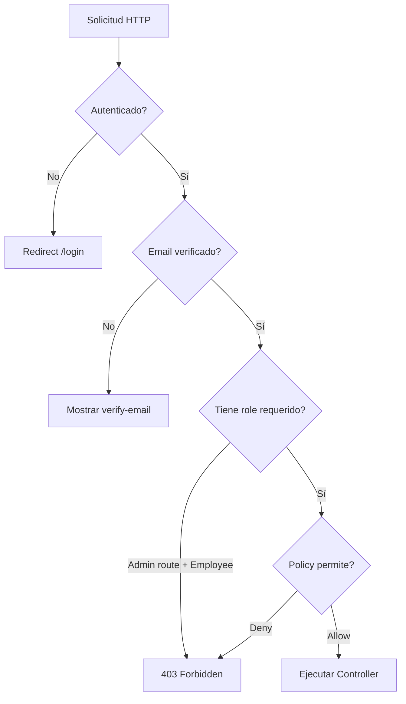

# 05 — Autenticación y Autorización

> Roles de usuario, middleware, policies y control de acceso.

---

## Diagrama de Flujo de Autorización



---

## Roles de Usuario

### Enum UserRole

**Archivo**: `app/Enums/UserRole.php`

| Rol | Valor | Label | Descripción |
|-----|-------|-------|-------------|
| `Admin` | `admin` | Administrador | Acceso total al sistema |
| `Employee` | `employee` | Empleado | Acceso limitado |

### Métodos del Enum

```php
UserRole::Admin->label();      // 'Administrador'
UserRole::Admin->isAdmin();    // true
UserRole::Admin->isEmployee(); // false
```

---

## Permisos por Rol

| Recurso | Admin | Employee |
|---------|-------|----------|
| **Dashboard** | Ver | Ver |
| **Categorías** | CRUD completo | Ver, crear, editar (no eliminar) |
| **Proveedores** | CRUD completo | Ver, crear, editar (no eliminar) |
| **Productos** | CRUD completo | Ver, crear, editar (no eliminar) |
| **Movimientos** | CRUD completo | Ver, crear |
| **Usuarios** | CRUD completo | No acceso |
| **Reportes** | Ver + exportar | Ver + exportar |
| **Auditoría** | Ver | No acceso |

---

## Middleware RoleMiddleware

**Archivo**: `app/Http/Middleware/RoleMiddleware.php`

```php
Route::get('/users', [UserController::class, 'index'])
    ->middleware('role:admin');
```

El middleware valida que el usuario autenticado tenga al menos uno de los roles especificados.

**Registro** en `bootstrap/app.php`:

```php
->withMiddleware(function (Middleware $middleware) {
    $middleware->alias([
        'role' => \App\Http\Middleware\RoleMiddleware::class,
    ]);
})
```

---

## Policies

### Resumen de Políticas

| Policy | Admin | Employee |
|--------|-------|----------|
| `UserPolicy` | full CRUD | viewAny, view (solo perfil propio) |
| `CategoryPolicy` | full CRUD | viewAny, view, create, update (no delete) |
| `SupplierPolicy` | full CRUD | viewAny, view, create, update (no delete) |
| `ProductPolicy` | full CRUD | viewAny, view, create, update (no delete) |
| `StockMovementPolicy` | full CRUD | viewAny, view, create |

### UserPolicy

| Método | Admin | Employee |
|--------|-------|----------|
| `viewAny($user)` | ✅ | ✅ |
| `view($user, $model)` | ✅ | ✅ (solo自身) |
| `create($user)` | ✅ | ❌ |
| `update($user, $model)` | ✅ | ✅ (solo自身) |
| `delete($user, $model)` | ✅ | ❌ |

### CategoryPolicy

| Método | Admin | Employee |
|--------|-------|----------|
| `viewAny($user)` | ✅ | ✅ |
| `view($user, $model)` | ✅ | ✅ |
| `create($user)` | ✅ | ✅ |
| `update($user, $model)` | ✅ | ✅ |
| `delete($user, $model)` | ✅ | ❌ |

### SupplierPolicy

| Método | Admin | Employee |
|--------|-------|----------|
| `viewAny($user)` | ✅ | ✅ |
| `view($user, $model)` | ✅ | ✅ |
| `create($user)` | ✅ | ✅ |
| `update($user, $model)` | ✅ | ✅ |
| `delete($user, $model)` | ✅ | ❌ |

### ProductPolicy

| Método | Admin | Employee |
|--------|-------|----------|
| `viewAny($user)` | ✅ | ✅ |
| `view($user, $model)` | ✅ | ✅ |
| `create($user)` | ✅ | ✅ |
| `update($user, $model)` | ✅ | ✅ |
| `delete($user, $model)` | ✅ | ❌ |

### StockMovementPolicy

| Método | Admin | Employee |
|--------|-------|----------|
| `viewAny($user)` | ✅ | ✅ |
| `view($user, $model)` | ✅ | ✅ |
| `create($user)` | ✅ | ✅ |
| `update($user, $model)` | ✅ | ❌ |
| `delete($user, $model)` | ✅ | ❌ |

---

## Autenticación (Fortify)

El proyecto usa **Laravel Fortify** para autenticación:

| Funcionalidad | Estado |
|---------------|--------|
| Login | ✅ Implementado |
| Registro | ✅ Implementado |
| Forgot Password | ✅ Implementado |
| Reset Password | ✅ Implementado |
| Email Verification | ✅ Implementado |
| Password Confirmation | ✅ Implementado |
| Two-Factor Auth (2FA/TOTP) | ✅ Implementado |
| Passkeys (WebAuthn) | ✅ Implementado |

---

*Ver también: [API y Rutas](04-api-rutas.md) · [Reportes y Auditoría](06-reporte-auditoria.md)*
