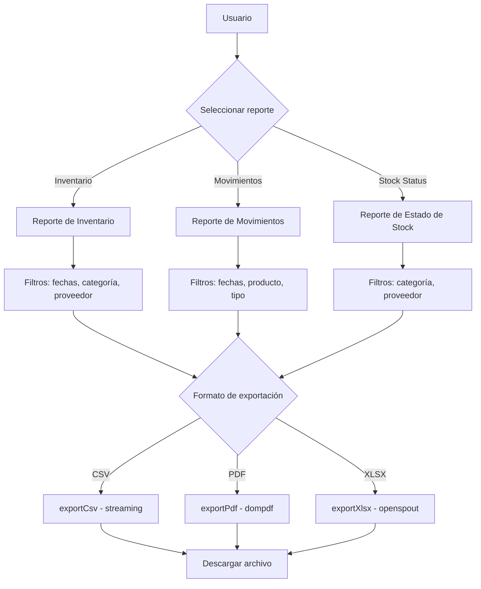
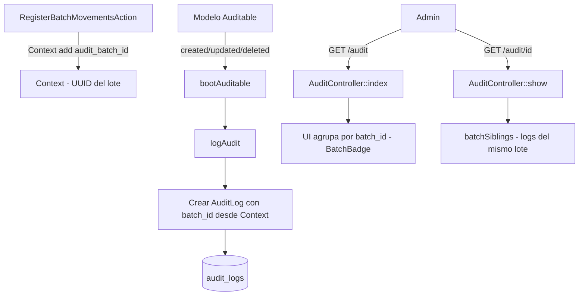

# 06 — Reportes y Auditoría

> Generación de reportes con exportación CSV/PDF/XLSX y sistema de auditoría.

---

## Diagrama de Flujo de Reportes



---

## Reportes Disponibles

### 1. Reporte de Inventario (`reports.inventory`) — **solo admin**

**Endpoint**: `GET /reports/inventory` (middleware `role:admin`)

**Contenido**:
- Valor total del inventario
- Productos por categoría (conteo y valor)
- Productos por proveedor (conteo y valor)
- Top 10 productos por valor

### 2. Reporte de Movimientos (`reports.movements`)

**Endpoint**: `GET /reports/movements`

**Contenido**:
- Entradas/salidas/ajustes por rango de fechas
- Movimientos por producto
- Movimientos por usuario
- Resumen diario/semanal/mensual

> **Scoping**: un employee solo ve y resume **sus** movimientos; el filtro `user_id` y la lista de usuarios solo aplican a admin.

### 3. Reporte de Estado de Stock (`reports.stock-status`)

**Endpoint**: `GET /reports/stock-status`

**Contenido**:
- Productos bajo mínimo (`current_stock_product <= minimum_stock_product`)
- Productos sin stock (`current_stock_product = 0`)
- Productos con exceso de stock
- Distribución por categoría

---

## Exportación

**Servicio**: `app/Services/ReportExportService.php`

### Formatos Soportados

| Formato | Paquete | Método |
|---------|---------|--------|
| CSV | Nativo PHP | `fputcsv()` con streaming |
| PDF | `barryvdh/laravel-dompdf` | renderiza la view `exports.pdf-table` con los datos |
| XLSX | `openspout/openspout` | `Writer` de Spout escribiendo filas directamente |

### Endpoints de Exportación

```
GET /reports/export/csv?report=inventory&date_from=...&date_to=...
GET /reports/export/pdf?report=movements&category_id=...
GET /reports/export/xlsx?report=stock-status&supplier_id=...
```

`report` = `inventory` | `movements` | `stock-status` (dispatch en `ReportController::export`).

### API del Servicio

```php
class ReportExportService
{
    // Públicos: reciben el tipo de archivo (csv|pdf|xlsx) + ReportRequest
    public function exportInventory(string $type, ReportRequest $request): SymfonyResponse;
    public function exportMovements(string $type, ReportRequest $request): SymfonyResponse;
    public function exportStockStatus(string $type, ReportRequest $request): SymfonyResponse;

    // Privados: formatos concretos, todos reciben Collection + headers/filename
    private function export(string $type, Collection $data, array $headers, string $filename): SymfonyResponse;
    private function exportCsv(Collection $data, string $filename, array $headers): SymfonyResponse;
    private function exportPdf(Collection $data, string $filename, array $headers): SymfonyResponse;
    private function exportXlsx(Collection $data, string $filename, array $headers): SymfonyResponse;
}
```

### Dependencias

```bash
composer require barryvdh/laravel-dompdf   # PDF
composer require openspout/openspout       # XLSX
```

---

## Auditoría

### Diagrama de Flujo de Auditoría



### Trait Auditable

**Archivo**: `app/Traits/Auditable.php`

Se agrega a los modelos que se desean auditar:

```php
use App\Traits\Auditable;

class Product extends Model
{
    use HasFactory, Auditable;
}
```

**Modelos auditable**: User, Product, Category, Supplier, StockMovement

### Eventos Registrados

| Evento | `old_values` | `new_values` |
|--------|-------------|-------------|
| `created` | `null` | Todos los atributos |
| `updated` | Valores originales (solo campos modificados) | Nuevos valores |
| `deleted` | Todos los atributos | `null` |

### Campos del Log

| Campo | Descripción |
|-------|-------------|
| `user_id` | Usuario que realizó la acción (nullable) |
| `batch_id` | UUID del lote que originó la operación (nullable) — correlaciona los logs de un `POST /movements` |
| `auditable_type` | Tipo del modelo auditado |
| `auditable_id` | ID del modelo auditado |
| `event` | `created`, `updated` o `deleted` |
| `old_values` | Valores anteriores (JSON) |
| `new_values` | Valores nuevos (JSON) |
| `ip_address` | IP del cliente |
| `user_agent` | User-Agent del navegador |

El trait `Auditable` escribe `'batch_id' => Context::get('audit_batch_id')`; el action de lote pone y limpia ese valor de Context.

### Scopes del Modelo AuditLog

| Scope | Parámetro | Descripción |
|-------|-----------|-------------|
| `scopeForModel($query, $type, $id)` | tipo, ID opcional | Filtrar por modelo |
| `scopeForEvent($query, $event)` | evento | Filtrar por tipo de evento |
| `scopeForUser($query, $userId)` | ID de usuario | Filtrar por usuario |
| `scopeForBatch($query, $batchId)` | UUID de lote | Todos los logs de un mismo lote |
| `scopeRecent($query, $days)` | días (default: 30) | Logs recientes |

### UI de Lotes (admin)

- `audit/index.tsx`: agrupa entradas por `batch_id` con badge **"Lote (n)"** y grupos expandibles.
- `audit/show.tsx`: recibe la prop `batchSiblings` (logs del mismo lote ordenados por `created_at`) y los muestra junto al detalle.

---

*Ver también: [Autorización](05-autorizacion.md) · [API y Rutas](04-api-rutas.md)*
