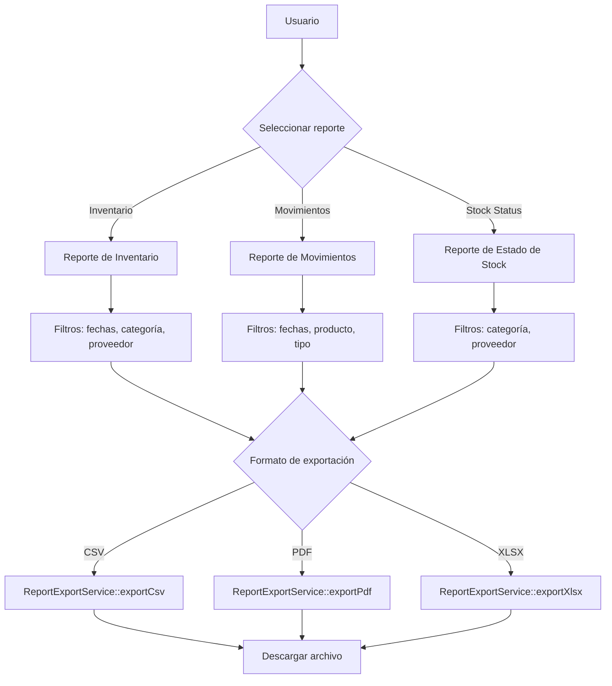
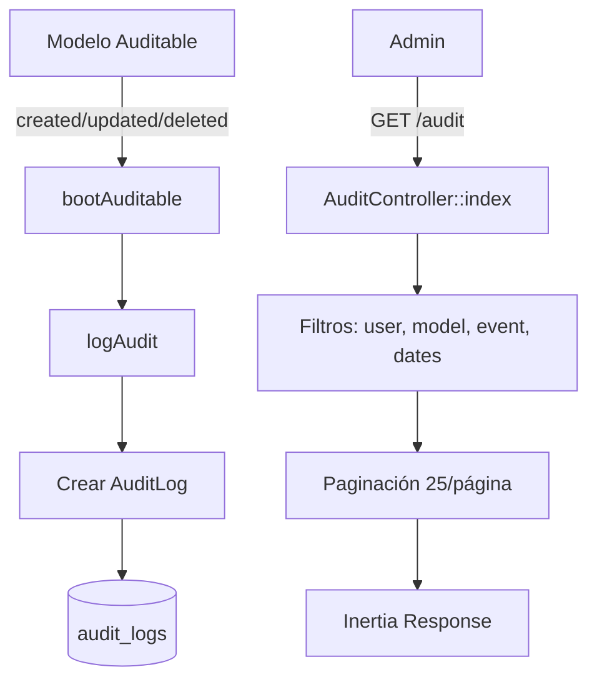

# 06 — Reportes y Auditoría

> Generación de reportes con exportación CSV/PDF/XLSX y sistema de auditoría.

---

## Diagrama de Flujo de Reportes



---

## Reportes Disponibles

### 1. Reporte de Inventario (`reports.inventory`)

**Endpoint**: `GET /reports/inventory`

**Contenido**:
- Valor total del inventario
- Productos por categoría (conteo y valor)
- Productos por proveedor (conteo y valor)
- Top 10 productos por valor

### 2. Reporte de Movimientos (`reports.movements`)

**Endpoint**: `GET /reports/movements`

**Contenido**:
- Entradas/salidas/ajustes por rango de fechas
- Movimientos por producto
- Movimientos por usuario
- Resumen diario/semanal/mensual

### 3. Reporte de Estado de Stock (`reports.stock-status`)

**Endpoint**: `GET /reports/stock-status`

**Contenido**:
- Productos bajo mínimo (`current_stock <= minimum_stock`)
- Productos sin stock (`current_stock = 0`)
- Productos con exceso de stock
- Distribución por categoría

---

## Exportación

**Servicio**: `app/Services/ReportExportService.php`

### Formatos Soportados

| Formato | Paquete | Método |
|---------|---------|--------|
| CSV | Nativo PHP | `fputcsv()` con streaming |
| PDF | `barryvdh/laravel-dompdf` | `Pdf::loadView()` |
| XLSX | `maatwebsite/excel` | `Excel::download()` |

### Endpoints de Exportación

```
GET /reports/export/csv?report=inventory&date_from=...&date_to=...
GET /reports/export/pdf?report=movements&category_id=...
GET /reports/export/xlsx?report=stock-status&supplier_id=...
```

### Métodos del Servicio

```php
class ReportExportService
{
    public function exportCsv(Collection $data, string $filename, array $headers): StreamedResponse;
    public function exportPdf(View $view, string $filename): BinaryFileResponse;
    public function exportXlsx(FromCollection $export, string $filename): BinaryFileResponse;
}
```

### Dependencias

```bash
composer require barryvdh/laravel-dompdf   # PDF
composer require maatwebsite/excel         # XLSX
```

---

## Auditoría

### Diagrama de Flujo de Auditoría



### Trait Auditable

**Archivo**: `app/Traits/Auditable.php`

Se agrega a los modelos que se desean auditar:

```php
use App\Traits\Auditable;

class Product extends Model
{
    use HasFactory, Auditable;
}
```

**Modelos auditable**: User, Product, Category, Supplier, StockMovement

### Eventos Registrados

| Evento | `old_values` | `new_values` |
|--------|-------------|-------------|
| `created` | `null` | Todos los atributos |
| `updated` | Valores originales (solo campos modificados) | Nuevos valores |
| `deleted` | Todos los atributos | `null` |

### Campos del Log

| Campo | Descripción |
|-------|-------------|
| `user_id` | Usuario que realizó la acción (nullable) |
| `auditable_type` | Tipo del modelo auditado |
| `auditable_id` | ID del modelo auditado |
| `event` | `created`, `updated` o `deleted` |
| `old_values` | Valores anteriores (JSON) |
| `new_values` | Valores nuevos (JSON) |
| `ip_address` | IP del cliente |
| `user_agent` | User-Agent del navegador |

### Scopes del Modelo AuditLog

| Scope | Parámetro | Descripción |
|-------|-----------|-------------|
| `scopeForModel($query, $type, $id)` | tipo, ID opcional | Filtrar por modelo |
| `scopeForEvent($query, $event)` | evento | Filtrar por tipo de evento |
| `scopeForUser($query, $userId)` | ID de usuario | Filtrar por usuario |
| `scopeRecent($query, $days)` | días (default: 30) | Logs recientes |

---

*Ver también: [Autorización](05-autorizacion.md) · [API y Rutas](04-api-rutas.md)*
