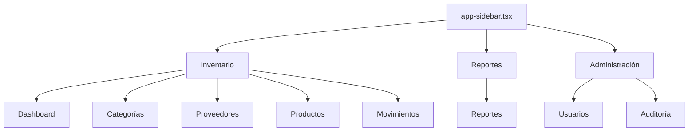

# 07 — Frontend

> React 19 + Inertia.js v3 + Tailwind CSS v4 + shadcn/ui — Arquitectura, componentes y convenciones.

---

## Stack

| Tecnología | Versión | Uso |
|-----------|---------|-----|
| React | 19 | UI library |
| Inertia.js | v3 | SPA bridge (Laravel ↔ React) |
| TypeScript | — | Type safety |
| Tailwind CSS | v4 | Utility-first CSS |
| shadcn/ui | — | Component library (Radix UI) |
| Lucide React | — | Icons |
| react-hook-form | — | Form handling |
| Zod | — | Schema validation |
| @tanstack/react-table | — | DataTable |
| Sonner | — | Toast notifications |
| Wayfinder | — | Typed route functions |

---

## Estructura de Archivos

```
resources/js/
├── types/                          # TypeScript type definitions
│   ├── auth.ts                     # User, Role types
│   ├── inventory.ts                # Product, Category, Supplier, etc.
│   ├── navigation.ts               # Nav items
│   └── ui.ts                       # UI utility types
├── hooks/                          # Custom React hooks
│   ├── use-debounce.ts
│   ├── use-local-storage.ts
│   ├── use-query-params.ts
│   └── ... (11 hooks)
├── components/
│   ├── ui/                         # shadcn/ui base (33 components)
│   │   ├── button.tsx
│   │   ├── card.tsx
│   │   ├── dialog.tsx
│   │   ├── form.tsx
│   │   ├── table.tsx
│   │   └── ... (28 more)
│   ├── inventory/                  # Shared inventory components (16)
│   │   ├── data-table.tsx          # Generic DataTable with @tanstack
│   │   ├── data-grid.tsx           # Responsive grid view
│   │   ├── filter-bar.tsx          # Filter bar
│   │   ├── search-input.tsx        # Search with debounce
│   │   ├── stat-card.tsx           # Statistics card
│   │   ├── form-drawer.tsx         # Drawer for forms
│   │   ├── empty-state.tsx         # Empty state placeholder
│   │   ├── confirm-dialog.tsx      # Confirmation modal
│   │   ├── pagination.tsx          # Pagination controls
│   │   ├── view-toggle.tsx         # List/Grid toggle
│   │   ├── stock-badge.tsx         # Stock level badge
│   │   ├── type-badge.tsx          # Movement type badge
│   │   ├── status-badge.tsx        # Status badge
│   │   ├── page-header.tsx         # Page header
│   │   ├── per-page-selector.tsx   # Items per page
│   │   └── searchable-select.tsx   # Searchable dropdown
│   ├── app-sidebar.tsx             # Main sidebar navigation
│   ├── nav-main.tsx                # Collapsible nav groups
│   └── ... (25+ app components)
├── pages/                          # Inertia page components
│   ├── dashboard.tsx
│   ├── auth/                       # 7 auth pages
│   ├── categories/                 # CRUD (4 pages)
│   ├── suppliers/                  # CRUD (4 pages)
│   ├── products/                   # CRUD (4 pages)
│   ├── movements/                  # Partial CRUD (3 pages)
│   ├── users/                      # CRUD admin-only (4 pages)
│   ├── reports/                    # Reports (4 pages)
│   ├── audit/                      # Audit logs (2 pages)
│   └── settings/                   # Profile, Security, Appearance (3 pages)
└── layouts/                        # Layout components
```

---

## Páginas por Módulo

### Dashboard
| Archivo | Descripción |
|---------|-------------|
| `dashboard.tsx` | Estadísticas, últimos movimientos, stock bajo |

### Auth (7 páginas)
| Archivo | Descripción |
|---------|-------------|
| `auth/login.tsx` | Login con card centrada, iconos en inputs |
| `auth/register.tsx` | Registro con validación visual |
| `auth/forgot-password.tsx` | Recuperación de contraseña |
| `auth/reset-password.tsx` | Restablecimiento de contraseña |
| `auth/confirm-password.tsx` | Confirmación de contraseña |
| `auth/verify-email.tsx` | Verificación de email |
| `auth/two-factor-challenge.tsx` | Challenge de 2FA |

### Categorías (4 páginas)
| Archivo | Descripción |
|---------|-------------|
| `categories/index.tsx` | Lista con tabla + filtros jerárquicos |
| `categories/create.tsx` | Formulario en drawer |
| `categories/show.tsx` | Detalle + productos + subcategorías |
| `categories/edit.tsx` | Formulario en drawer |

### Proveedores (4 páginas)
| Archivo | Descripción |
|---------|-------------|
| `suppliers/index.tsx` | Lista con búsqueda |
| `suppliers/create.tsx` | Formulario en drawer |
| `suppliers/show.tsx` | Detalle + productos |
| `suppliers/edit.tsx` | Formulario en drawer |

### Productos (4 páginas)
| Archivo | Descripción |
|---------|-------------|
| `products/index.tsx` | Vista dual lista/grid + filtros avanzados |
| `products/create.tsx` | Formulario completo en drawer |
| `products/show.tsx` | Detalle completo |
| `products/edit.tsx` | Formulario en drawer |

### Movimientos (3 páginas)
| Archivo | Descripción |
|---------|-------------|
| `movements/index.tsx` | Tabla con filtros |
| `movements/create.tsx` | Formulario con lógica condicional |
| `movements/show.tsx` | Detalle del movimiento |

### Usuarios (4 páginas — admin only)
| Archivo | Descripción |
|---------|-------------|
| `users/index.tsx` | DataTable: Nombre, Email, Rol (badge), Creado |
| `users/create.tsx` | Formulario: name, email, password, role |
| `users/show.tsx` | Info del usuario, badge de rol |
| `users/edit.tsx` | Formulario sin password obligatorio |

### Reportes (4 páginas)
| Archivo | Descripción |
|---------|-------------|
| `reports/index.tsx` | 3 stat cards clickeables |
| `reports/inventory.tsx` | Resumen + tabla + filtros + export |
| `reports/movements.tsx` | Stats por tipo + tabla + filtros fecha |
| `reports/stock-status.tsx` | 3 stat cards + desglose por categoría |

### Auditoría (2 páginas — admin only)
| Archivo | Descripción |
|---------|-------------|
| `audit/index.tsx` | DataTable: Usuario, Modelo, Evento (badge), IP, Fecha |
| `audit/show.tsx` | Metadata + JSON formateado old/new values |

### Settings (3 páginas)
| Archivo | Descripción |
|---------|-------------|
| `settings/profile.tsx` | Info personal + zona de peligro |
| `settings/security.tsx` | Contraseña, 2FA, Passkeys |
| `settings/appearance.tsx` | Light/Dark/System selector |

---

## Navegación (Sidebar)



- **Inventario**: Accesible para todos los roles.
- **Reportes**: Accesible para todos los roles.
- **Administración**: Solo visible para `admin`.

---

## Convenciones de Código

### Componentes

```tsx
// Function declaration + data-slot + ComponentProps
function DataTable({ data, columns }: DataTableProps) {
  return <div data-slot="data-table">...</div>;
}
```

### Estilos

```tsx
// Siempre usar cn() para combinar clases
import { cn } from '@/lib/utils';

<div className={cn('base-classes', conditional && 'conditional-classes')} />
```

### Routing (Wayfinder)

```tsx
import { route } from '@/routes';

// En vez de: href="/categories"
<Link href={route('categories.index')}>Categorías</Link>

// En vez de: href={`/products/${id}`}
<Link href={route('products.show', { product: product.id })}>Ver</Link>
```

### Forms

```tsx
import { Form } from '@/components/ui/form';
import { useForm } from 'react-hook-form';
import { zodResolver } from '@hookform/resolvers/zod';
import { z } from 'zod';

const schema = z.object({ name: z.string().min(1) });

function CreateForm() {
  const form = useForm({ resolver: zodResolver(schema) });
  return <Form {...form}>...</Form>;
}
```

### Toasts

```tsx
import { toast } from 'sonner';

toast.success('Categoría creada exitosamente');
toast.error('Error al eliminar la categoría');
```

### Inertia

```tsx
import { Head, Link, usePage, useForm } from '@inertiajs/react';

// usePage() para acceder a props
const { auth } = usePage().props;

// useForm() para formularios con inertia
const { data, setData, post, processing, errors } = useForm({...});
```

---

## Backend API (Inertia Props)

Cada página recibe sus datos del controlador vía Inertia:

| Página | Props del Backend |
|--------|-------------------|
| Dashboard | `stats`, `recentMovements`, `lowStockProducts` |
| Categories Index | `categories` (paginada), `filters` |
| Categories Create | `parentCategories` |
| Categories Show | `category` (con parent/children/products) |
| Products Index | `products` (paginada), `categories`, `suppliers`, `filters` |
| Movements Create | `products`, `types` |
| Users Index | `users` (paginada), `filters` (search, role) |
| Reports Inventory | `products`, `summary`, `filters` |
| Audit Index | `logs` (paginada), `filters` |

---

*Ver también: [Testing](08-testing.md) · [API y Rutas](04-api-rutas.md)*
